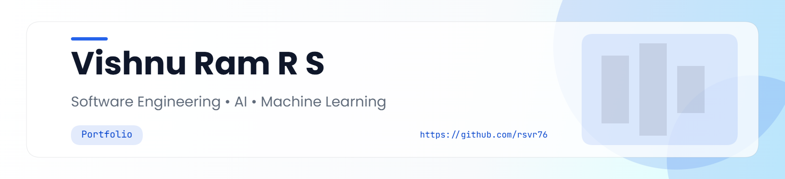

<picture>
  <source media="(prefers-color-scheme: dark)" srcset="art/header-dark.png">
  
</picture>

  

<!-- ========================================================= -->
<!-- 1. HERO -->
<!-- ========================================================= -->

  

  

Turning ideas into intelligent software through AI, Machine Learning, and clean engineering.

  

<!-- ========================================================= -->
<!-- 2. ABOUT ME -->
<!-- ========================================================= -->

<h2 align="center">🚀 About Me</h2>

I'm an <strong>Electrical & Electronics Engineering</strong> undergraduate passionate about building software that combines
Artificial Intelligence, Machine Learning, and modern Software Engineering.

I enjoy solving real-world problems through backend development, intelligent systems,
automation, and continuous learning.

 

  

<!-- ========================================================= -->
<!-- 3. FEATURED WORK -->
<!-- ========================================================= -->

<h2 align="center">💼 Featured Work</h2>

A few projects that showcase my interests in Software Engineering,
Artificial Intelligence, and Machine Learning.

---

### 🏆 CAD-to-Quote AI Agent

AI-assisted manufacturing cost estimation from STEP CAD files using explainable machine learning.

**Tech Stack**

`Python` `OpenCascade` `Scikit-learn` `SHAP`

🔗 **Repository**

https://github.com/rsvr76/CAD-to-Quote-AI-Agent

---

### 🚨 Crisis Commander

AI-powered emergency response platform that converts voice calls into actionable incident reports.

**Tech Stack**

`Python` `FastAPI` `Gemini API`

🔗 **Repository**

https://github.com/rsvr76/Crisis-Commander

---

### 🌊 Ocean Depths Odyssey

Interactive web experience visualizing Earth's oceans from sea level to Challenger Deep.

**Tech Stack**

`React` `TypeScript`

🔗 **Repository**

https://github.com/rsvr76/Ocean-Depths-Frontend-Odyssey

  

<!-- ========================================================= -->
<!-- 4. TECH STACK -->
<!-- ========================================================= -->

<h2 align="center">🛠 Tech Stack</h2>

  

<!-- ========================================================= -->
<!-- 5. DEVELOPMENT ACTIVITY -->
<!-- ========================================================= -->

<h2 align="center">📊 Development Activity</h2>

Building consistently and contributing to projects over time.

  

<!-- ========================================================= -->
<!-- 6. LET'S CONNECT -->
<!-- ========================================================= -->

<h2 align="center">🤝 Let's Connect</h2>

  

<!-- ========================================================= -->
<!-- 7. CONTRIBUTION SNAKE -->
<!-- ========================================================= -->

<h2 align="center">🐍 Contribution Snake</h2>

<picture>
  <source media="(prefers-color-scheme: dark)" srcset="https://raw.githubusercontent.com/rsvr76/rsvr76/output/github-contribution-grid-snake-dark.svg">
  <source media="(prefers-color-scheme: light)" srcset="https://raw.githubusercontent.com/rsvr76/rsvr76/output/github-contribution-grid-snake.svg">
  
</picture>

  

<!-- ========================================================= -->
<!-- 8. FOOTER -->
<!-- ========================================================= -->

